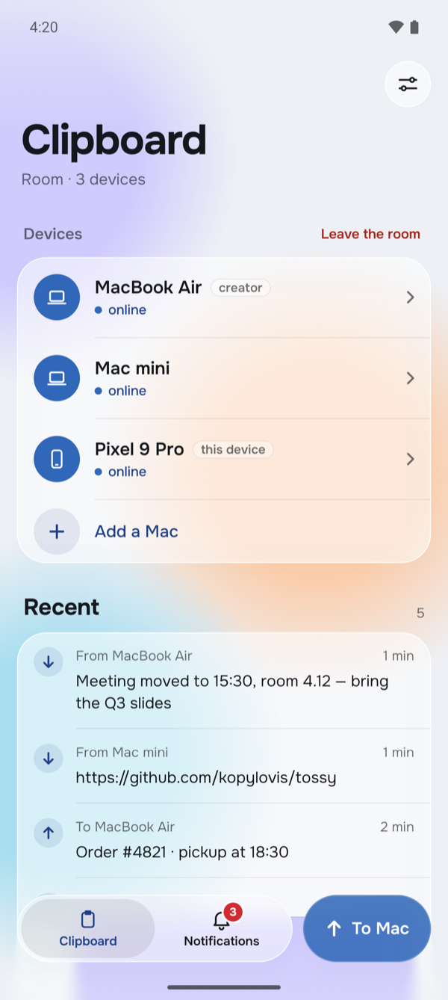
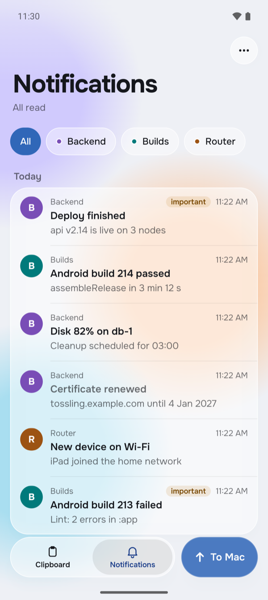

<p align="center">
  
</p>

<h1 align="center">Tossling for Android</h1>

<p align="center">
  One clipboard for your Android phone and your computers, through your own server.<br>
  Copy on the computer, paste on the phone, and the other way round. Everything is encrypted on the devices.
</p>

<p align="center">
  <a href="https://github.com/tossling/tossling-mobile/releases/latest"></a>
  
  
  <a href="LICENSE"></a>
</p>

<p align="center">
  
  &nbsp;&nbsp;
  
</p>

It works with your own [Tossling Server](https://github.com/tossling/tossling-server); the server only relays
ciphertext.

The apps for macOS, Windows and Linux live in
[tossling/tossling-desktop](https://github.com/tossling/tossling-desktop). An iOS app is in progress.

## What it does

- Text, links, images and files up to 500 MB in both directions; files land in Downloads/Tossling.
- All devices share one room: a phone and any number of computers.
- Pairing with a Mac by QR code (`tossling pair` on the Mac), another Mac joins with `tossling invite` / `tossling join`.
- Every device has its own X25519 key. Disconnecting a device moves the rest of the room to a new key
  and to a new server token.
- History with search and pins, a home screen widget, «Share → To Mac».
- Project notifications: services publish events to channels of your server, and every device shows them;
  the list of projects is shared by all devices.
- Reinstalled the app? With Google backup on, the welcome screen offers to return to the room as the same device,
  no QR code needed (the room key stays on the phone, it is not backed up to the cloud).
- Servers without push: «Keep a connection» holds one live connection, so events arrive at once even in Doze.

## Requirements

- Android 13 (API 33) or newer.
- A [Tossling Server](https://github.com/tossling/tossling-server): one Docker container with a setup page.
  Pairing goes through a computer (`tossling pair` on a Mac or Devices, then Connect a Phone on Windows and Linux shows a QR code). Any ntfy server with token authentication,
  attachments up to 520 MB and the right access rules works too; Tossling Server sets all of that up by itself.

## Building

JDK 21 and the Android SDK are needed; Gradle downloads everything else from Google Maven and Maven Central.

```bash
./gradlew testDebugUnitTest assembleDebug
```

Optional local files, all ignored by git:

| File | What for |
| --- | --- |
| `app/google-services.json` | «Instant delivery»: Firebase Cloud Messaging wakes the app when something arrives. Without it new items arrive when the app opens. |
| `tossling.jks` + `keystore_password`, `keystore_alias` in `local.properties` | Signing release builds. Without it the release APK is unsigned. |
| `firebase_app_id`, `firebase_project`, `firebase_groups` in `local.properties` | Firebase App Distribution, see below. The same values can come from `FIREBASE_APP_ID`, `FIREBASE_PROJECT`, `FIREBASE_GROUPS`. |

## iOS (in progress)

`ios/` is the iPhone and iPad app, native SwiftUI on iOS 17 and newer. On iOS 26 it uses Liquid Glass, on older
versions the same screens fall back to system materials. Encryption, rooms and messages come from
`modules/common/protocol`, built as the static framework `TosslingKit`. The app itself only talks to the server
through `URLSession` and keeps the room in the Keychain.

It pairs with a computer by its QR code, receives text, images and files while it is open (files go to Files, On My
iPhone, Tossling) and sends the clipboard, photos and files. Push notifications, a share extension and a Shortcuts
action come next.

```bash
brew install xcodegen
cd ios && xcodegen generate && open Tossling.xcodeproj
```

The Xcode project is generated from `ios/project.yml`. Its build phase runs Gradle to build `TosslingKit`, so
JDK 21 must be installed.

## Distribution to testers

```bash
bundle exec fastlane upload notes:"what changed"
```

It bumps `app/version-code.txt`, builds a signed release APK, checks the signature and uploads it to
Firebase App Distribution (`firebase login` once, or a service account in `GOOGLE_APPLICATION_CREDENTIALS`).
`bundle exec fastlane check` lists the tester groups.

## Releases on GitHub

```bash
deploy/release-github.sh
```

Builds a release APK signed with the local `tossling.jks`, checks the signature and publishes `Tossling-<version>.apk`
with its SHA-256 as the GitHub release `v<version>`. The key never leaves the machine; raise `appversion` in
`gradle/libs.versions.toml` for the next release.

## Continuous integration

`.github/workflows/android.yml` runs the unit tests and builds debug and unsigned release APKs on every push
and pull request, and the APKs are attached to the run. A second job runs the protocol tests on the iOS simulator and builds
the iOS app.
It needs no secrets.

## Protocol compatibility

What the apps send to each other is described in
[PROTOCOL.md](https://github.com/tossling/tossling-server/blob/main/docs/PROTOCOL.md) in the server repository.
`modules/common/protocol` implements it. It is a Kotlin Multiplatform module with no Android code. Messages,
encryption, rooms and invites live in common code and build for the JVM and for iOS. The Android app, the desktop
apps for Windows and Linux and the iOS app in progress use it. Encryption goes through
[cryptography-kotlin](https://github.com/whyoleg/cryptography-kotlin), which uses CryptoKit on iOS, and through
`javax.crypto` on the JVM. The server API client is JVM-only for now.

The test vectors in `modules/common/protocol/src/jvmTest/resources/vectors.json` are a copy of the server's
`docs/vectors.json`, the same file the Mac app tests against. The common tests run on the JVM and on the iOS
simulator (`./gradlew :modules:common:protocol:allTests` on a Mac), and CI runs both.

## Reporting a vulnerability

See [SECURITY.md](SECURITY.md).

## License

GPL-3.0, see LICENSE.
